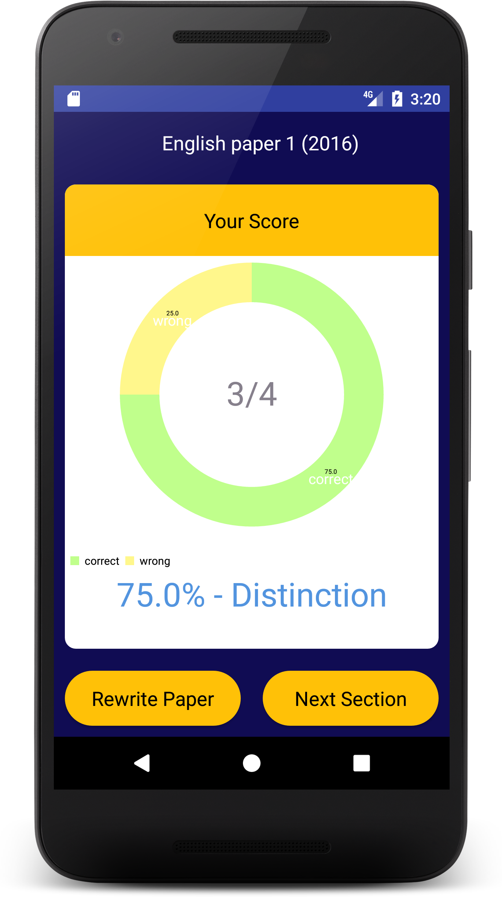

# Study Buddy: Exam Mastery 
## Android Version

###Features:
- This app is intended to be a revision tool for students at all levels.
- It can present multiple choice, true- false and essay type question questions.
- Provides answers and explanations for the answers. 
- Written in native android java code and utilizing Realm as a noSQL database.
- New content is updated remotely on devices with the app installed.
- Content can be tailored to any institution/Programme/Exam.

###Screenshots:

